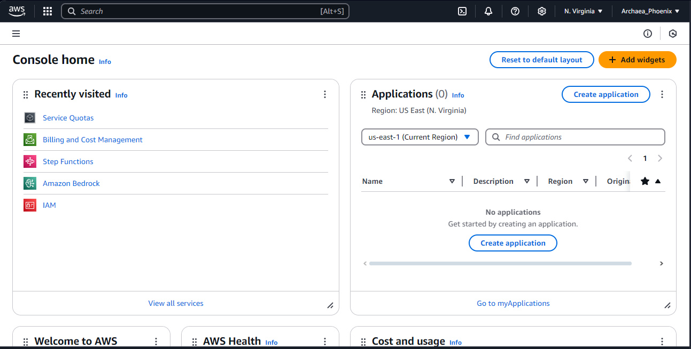
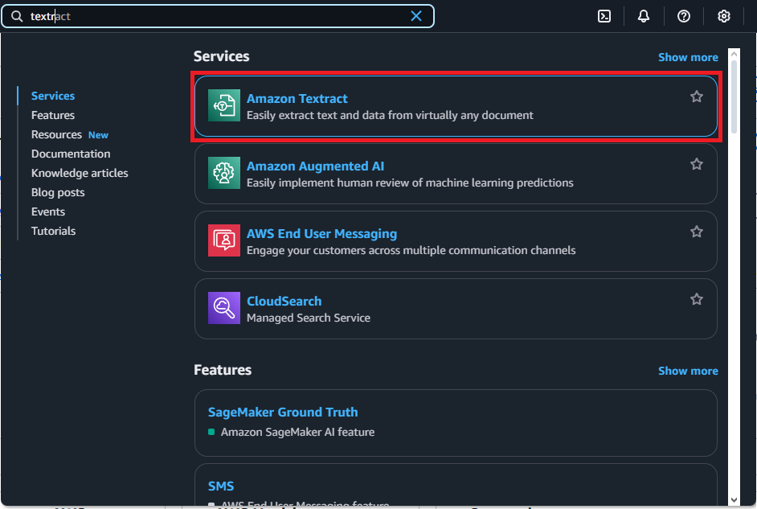
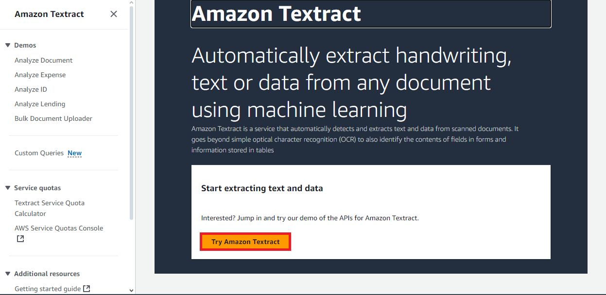
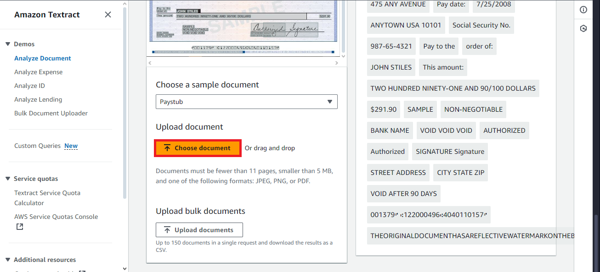
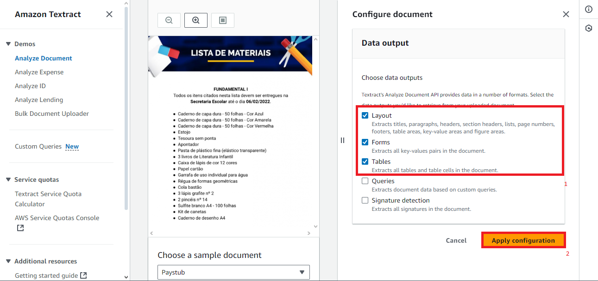
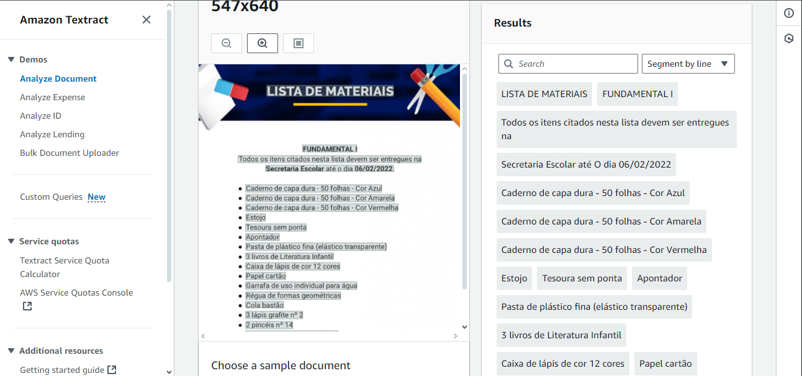

# dio-challenges-aws-textract
Project made during DIO's "Nexa - Análise Avançada de Imagens e Texto com IA na AWS" Bootcamp, under the section "Transcrevendo uma Imagem em Texto com AWS Textract". \
This project has two sections: Using AWS Textract on Web and Using AWS Textract with Python 3 (boto3)

----------------

# Requirements

- An AWS account configured on IAM with access to Amazon Textract

# Used tools

- VS Code
- Python
- AWS Account

------------------

# 1. Using AWS Textract on Web

To use the Amazon Textract on the AWS Portal, I followed the steps below:

1. Open AWS Portal

2. On AWS Portal search bar, type "Amazon Textract"

4. After opening the Amazon Textract page, click on "Try Amazon Textract"

5. On the demo page, scroll down to the page bottom and click on "Choose document", under "Upload document" section

  
6. After uploading the image, select, under "Data output", the "Layout", "Forms" and "Tables" checkboxes, then
	click on "Apply configuration"

The obtained result was the following:

----------------------

# 2. Using AWS Textract with Python 3 (boto3)

I also used Amazon Textract from Python's `boto3` client. I generated the `results.json` file after running `main.py`, which also prints the extracted text.
